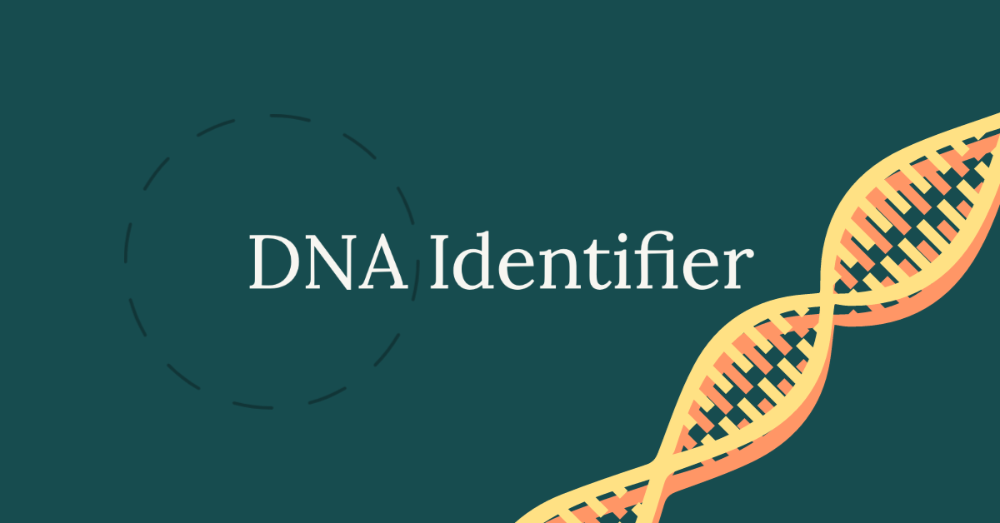

# DNA Identifier

## :dart: Subject
- Python program that identifies a person based on their DNA by reading data from a CSV file.
- DNA has been used in criminal justice for decades. **But how can forensic investigators identify to whom it belongs?**
- Well, DNA is just a sequence of molecules.  Each of them contains one of four different bases: 
   - adenine (A)
   - cytosine (C)
   - guanine (G)
   - thymine (T)
- Humans have DNA arrange in ways that can repeat in unique short sequences called STR (Short Tandem Repeats).
- These repetitions can help us identify a person by its DNA.

## :pencil: Example
 - As exmaple, Alice has the STR ```AGAT``` repeated four times in her DNA, while Bob has the same STR repeated five times.
 
 - With this information, we can create a program that analyzes a sequence of DNA (from the **sequences** folder) a look for matches of other people DNA sequences (from **database** folder).
 
## :wrench: Usage
- It will read the information from a CSV table and process it accord
```bash
python dna.py databases/large.csv sequences/5.txt
```
- If we run ```python dna.py databases/small.csv sequences/1.txt``` the program will output ```Bob```.
- If we run ```python dna.py databases/large.csv sequences/15.txt``` the program will output ```Sirius ```.
- If we run ```python dna.py databases/small.csv sequences/3.txt``` the program will output ```No match``` since there are no matches with our database.

## :books: Resources
https://cs50.harvard.edu/college/2021/spring/psets/6/dna/
